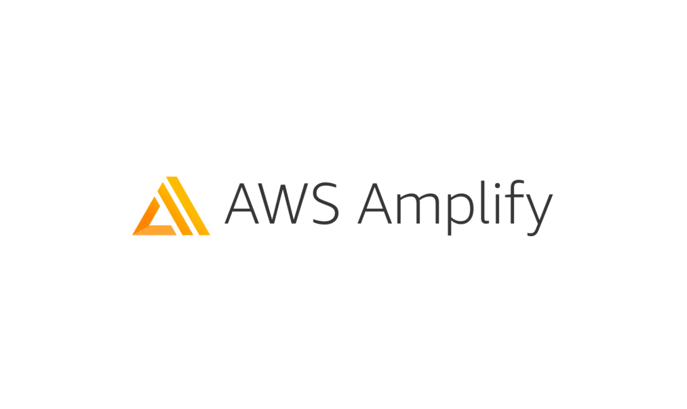

# Overview of AWS Amplify

## What is AWS Amplify?

AWS Amplify is a development platform that enables rapid creation of secure, scalable full-stack applications. It provides a unified workflow for frontend and backend development by abstracting AWS service complexity into simple, developer-friendly APIs.

Amplify eliminates infrastructure management overhead, allowing developers to focus on application logic rather than operational concerns. It provides production-ready backends with minimal configuration while maintaining the flexibility to customize underlying AWS services.

## Key Capabilities

**Authentication & Authorization**

- Amazon Cognito integration for user management
- Multi-factor authentication and social login support
- Fine-grained access control with user roles and permissions

**Data Management**

- GraphQL APIs with real-time subscriptions via AWS AppSync
- Type-safe client code generation for frontend frameworks
- Automatic CRUD operations and relationship management

**File Storage**

- Amazon S3 integration with user-specific access controls
- Automatic file processing and optimization
- Secure upload/download with presigned URLs

**Deployment & Hosting**

- Git-based continuous deployment
- Global content delivery via Amazon CloudFront
- Custom domains with automatic SSL certificate management

## Technical Architecture

Amplify generates standard AWS infrastructure including:

- DynamoDB tables for data persistence
- Lambda functions for business logic
- IAM roles and policies for security
- CloudFormation templates for infrastructure as code

## Development Workflow

1. Define backend resources using TypeScript configuration
2. Deploy infrastructure to AWS with single command
3. Generate type-safe client libraries for frontend integration
4. Implement application features using generated APIs

## Production Readiness

Applications built with Amplify include:

- Automatic scaling and load balancing
- Built-in monitoring and logging
- Security best practices by default
- Multi-environment support (dev, staging, production)
