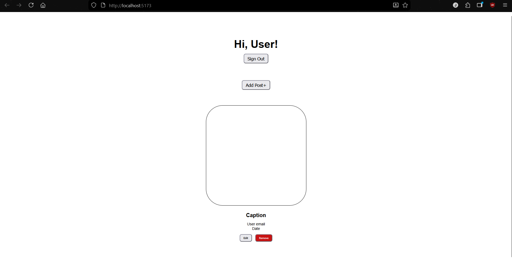

# Creating Your Frontend Application

Now let's get your frontend application set up, where we will be using [React](../workshop-elements.md#react). Instead of starting from scratch, we've prepared a starter template that includes all the basic components you'll need for this workshop.


## Getting the Starter Code

We've created a GitHub template with a pre-built React application that includes the basic structure for our workshop. This saves you time setting up boilerplate code and lets us focus on the Amplify integration.

*[Image placeholder: GitHub template creation process]*

Here's how to get started:

1. **[Create a repository from our Github Template](https://github.com/new?template_name=amplify-gen2-workshop&template_owner=ThatDott)**

      Go and create a repository using our [Github Template](https://github.com/new?template_name=amplify-gen2-workshop&template_owner=ThatDott) and follow the prompts to create your own copy.

2. **Clone the repository to your local machine**

      Once GitHub creates your repository, you'll need to download it to your computer. Copy the repository URL from GitHub and run:

      ```bash
      git clone https://github.com/<your-username>/<repo-name>.git
      ```

      *[Image placeholder: Git clone command in terminal]*

3. **Navigate into your project folder**

      ```bash
      cd <repo-name>
      ```

4. **Install the project dependencies**

      This downloads all the JavaScript packages your project needs:
      ```bash
      npm install
      ```

      *[Image placeholder: npm install output showing package installation]*

5. **Start the development server**

      ```bash
      npm run dev
      ```

Your React application should now be running locally. Open your browser and go to [http://localhost:5173/](http://localhost:5173/) to see it in action.



The starter application includes a very basic layout with components for user authentication and posts. Right now, these components are completely static and does not do anything. In the next sections, we'll connect them to real AWS services to make them functional.
