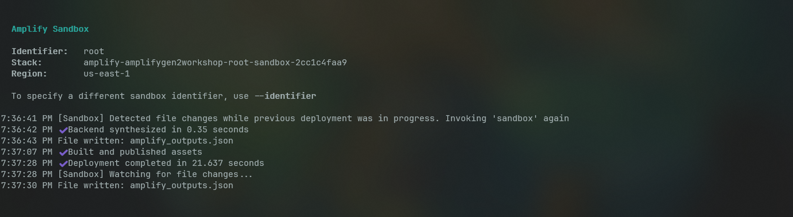
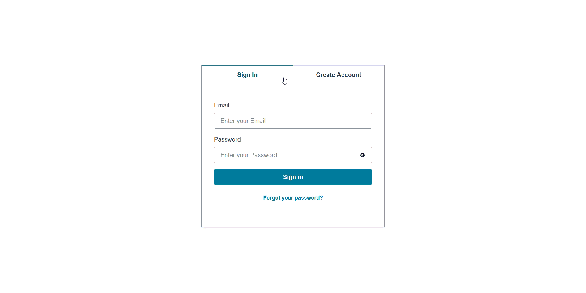
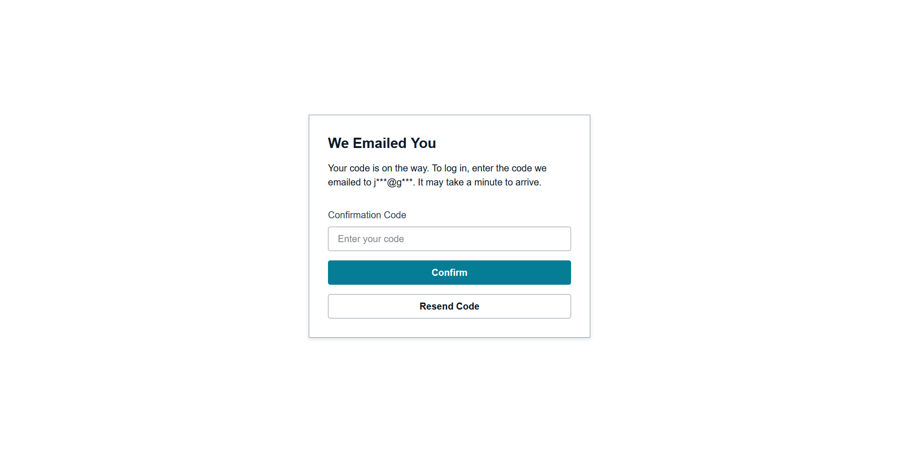
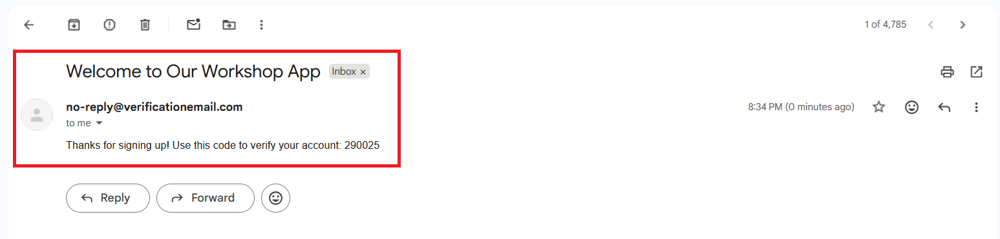
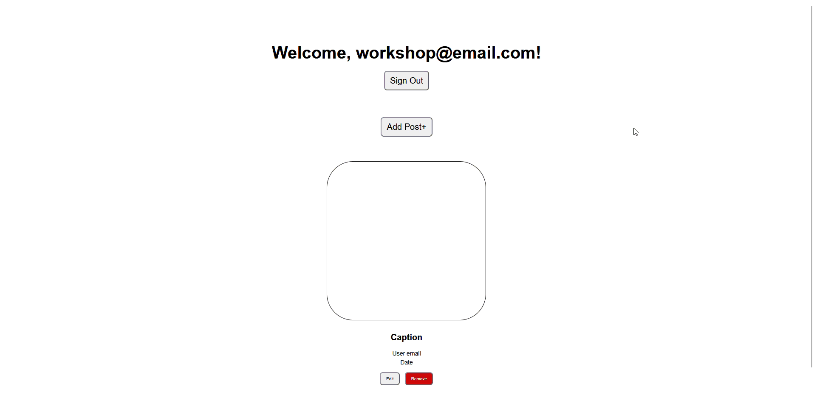

# Adding Authentication

Let's add user authentication to your application. This is where **Amplify Auth** comes in, which handles all the complex security stuff so you don't have to.

Under the hood, it uses **[AWS Cognito](../workshop-elements.md#amazon-cognito)**, a user identity and access management service. It handles user registration, login, password resets, email verification, and even multi-factor authentication.

Cognito consists of two main components:

- **User Pools** - Store user information and handle authentication
- **Identity Pools** - Provide temporary AWS credentials for authenticated users

Amplify sets up both of these for you automatically.

## Defining Your Authentication Resource

First, let's create the authentication configuration. In your `amplify` folder, create a new directory for auth resources:

```bash
mkdir auth
cd auth
```

Inside, create a file called `resource.ts`:

```typescript
// amplify/auth/resource.ts

import { defineAuth } from '@aws-amplify/backend';

export const auth = defineAuth({
  loginWith: {
    email: true,
  }
});
```

This configuration tells Cognito to use email addresses as usernames. Users will register and log in with their email address and a password. Cognito will automatically handle email verification to ensure users own the email addresses they register with.

**Customizing the verification email (optional):**

If you want to customize the verification email that users receive, you can expand the configuration:

```typescript
// amplify/auth/resource.ts

import { defineAuth } from '@aws-amplify/backend';

export const auth = defineAuth({
  loginWith: {
    email: {
      verificationEmailStyle: "CODE",
      verificationEmailSubject: "Welcome to Our Workshop App",
      verificationEmailBody: (createCode) => 
        `Thanks for signing up! Use this code to verify your account: ${createCode()}`,
    },
  }
});
```

## Registering Auth with Your Backend

Now we need to tell Amplify about our authentication resource. Open `backend.ts` and update it:

```typescript
// amplify/backend.ts

import { defineBackend } from '@aws-amplify/backend';
import { auth } from './auth/resource';

defineBackend({
  auth,
});
```

This registers your authentication configuration with Amplify's backend system. When you deploy, Amplify will create all the necessary Cognito resources in your AWS account.

## Deploying Your Authentication Backend

Time to deploy your authentication system to AWS. Run this command from your project root:

```bash
npx ampx sandbox
```

When you run this command, several things happen:

1. **Amplify reads your backend definitions** - It scans your `amplify/` folder and understands what resources you want to create

2. **Creates a cloud sandbox** - This is an isolated AWS environment for development and testing. It's separate from production, so you can experiment safely

3. **Provisions AWS resources** - Amplify creates a Cognito User Pool, Identity Pool, and all the necessary IAM roles and policies

4. **Generates configuration** - Once everything is deployed, Amplify creates `amplify_outputs.json` with all the connection details your frontend needs

The deployment usually takes a few minutes. You'll see progress updates in your terminal, and when it's complete, you'll have a fully functional authentication system running in AWS.



## Connecting Your React App to Cognito

Now let's connect your frontend to the authentication backend. Open `App.tsx` and add these imports at the top:

```typescript
// src/App.tsx
import { Amplify } from 'aws-amplify';
import outputs from '../amplify_outputs.json';

Amplify.configure(outputs);
```

The `amplify_outputs.json` file contains all the configuration details (like Cognito pool IDs and AWS region) that your app needs to connect to your backend. `Amplify.configure()` reads this file and sets up the connection automatically.

Your React app can now communicate with your AWS Cognito backend!

## Adding the Authentication UI

Instead of building login and registration forms from scratch, we'll use Amplify's pre-built `<Authenticator/>` UI component. This component automatically works with your Cognito configuration and handles all the authentication flows.

First, install the UI library:

```bash
npm add @aws-amplify/ui-react
```

Now update your `App.tsx` to import the amplify UI:

```typescript
// src/App.tsx

import { Authenticator } from '@aws-amplify/ui-react';
import '@aws-amplify/ui-react/styles.css';
```

Then wrap your app with the Authenticator component

```typescript
// src/App.tsx
function App() {
  return (
    <Authenticator>
      <main>
        <User />
        <Posts />
      </main>
    </Authenticator>
  );
}
```

**What It Does:**

The `<Authenticator>` component is like a security gate for your app. It automatically shows login/registration forms to unauthenticated users and only displays your app content once they're logged in. 

It handles:

- User registration with email verification
- User login
- Password reset flows
- Form validation and error handling

Save your changes and check your app. You should now see a sign-in form and a sign-up form:



If you had set up a customized email earlier, it would now show up in your email inbox during account creation:





## Adding Sign-Out Functionality

Users can sign in, but they also need a way to sign out. Let's add that to your User component.

Open `User.tsx` and import the authentication hook:

```typescript
// src/components/User.tsx

import { useAuthenticator } from "@aws-amplify/ui-react";
```

Now use the hook to access user information and the sign-out function:

```typescript
// src/components/User.tsx

export function User() {
  const { user, signOut } = useAuthenticator();
  const email = user?.signInDetails?.loginId;
```
Replace JSX content with dynamic values and assign the `signOut` function to the button:

```typescript
// src/components/User.tsx

  return (
    <div className="user-container">
      <h1>Welcome, {email}!</h1>
      <button onClick={signOut}>Sign Out</button>
    </div>
  );
```

The `useAuthenticator` hook gives you access to the current user's information and authentication functions. The `user` object contains details about the logged-in user, and `signOut` is a function that logs them out and returns them to the login screen.



You now have a fully functional authentication system powered by AWS Cognito! 

Users can register, verify their email, log in, and log out. All the security, scaling, and infrastructure is handled by AWS, so you can focus on building your app's features.

---

In the next section, we'll add a database and API so authenticated users can create and share content.
