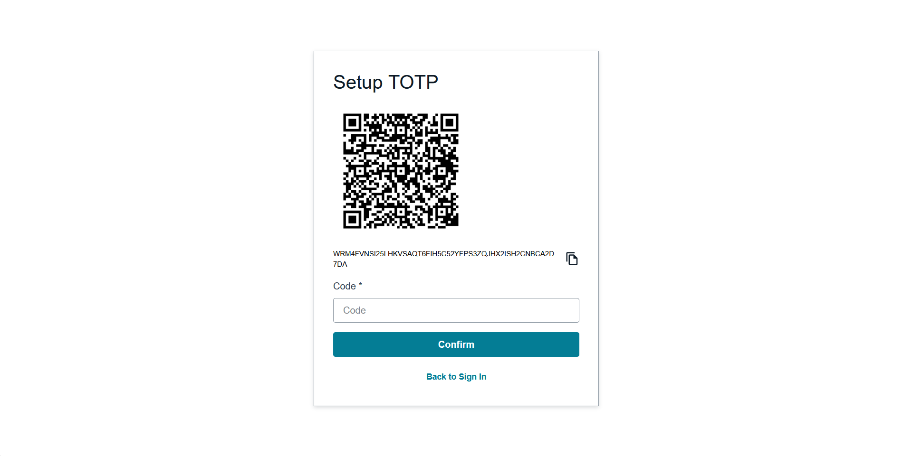
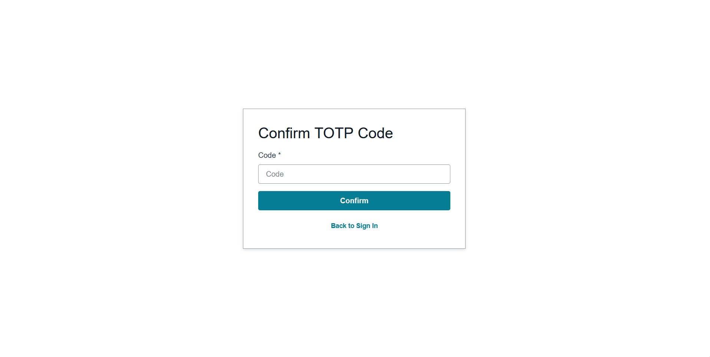

# Enable Multi-Factor Authentication

Now that we have basic authentication working, let's add an extra layer of security with Multi-Factor Authentication (MFA). This ensures that even if someone gets hold of a user's password, they still can't access the account without the second factor.

---

## Configuring MFA in Your Auth Resource

Go to your `/auth/resource.ts` file. We're going to enhance our authentication configuration to require MFA for all users.

Update your auth configuration to include the `multifactor` property:

```typescript
// amplify/auth/resource.ts
import { defineAuth } from '@aws-amplify/backend';

export const auth = defineAuth({
  loginWith: {
    email: {
      verificationEmailStyle: "CODE",
      verificationEmailSubject: "Welcome to Our Workshop App",
      verificationEmailBody: (createCode) => 
        `Thanks for signing up! Use this code to verify your account: ${createCode()}`,
    },
  },
  multifactor: {
    mode: 'REQUIRED',
    totp: true,
  },
});
```

Let's break down what we've added:

- **`multifactor.mode: 'REQUIRED'`** makes MFA mandatory for all users. Every user must set up MFA during their first sign-in.
- **`totp: true`** enables Time-based One-Time Password (TOTP) authentication, which works with apps like **Google Authenticator**, **Authy**, or **Microsoft Authenticator**.

## Deploy the Updated Configuration

After updating your auth resource, you need to deploy these changes to your sandbox:

```bash
npx ampx sandbox
```

This will update your Cognito User Pool to require MFA for all users.

## How MFA Works for Users

With this configuration, here's what happens when a new user signs up:

1. **Initial Sign-up**: User creates an account with email and password
2. **Email Verification**: User receives and enters the verification code from email
3. **MFA Setup Required**: On first sign-in, user is prompted to set up TOTP MFA
4. **QR Code Scan**: User scans a QR code with their authenticator app
5. **TOTP Verification**: User enters the 6-digit code from their authenticator app
6. **Future Sign-ins**: User provides both password and current TOTP code

## Testing MFA

Try creating a new user account now. You'll notice that after email verification, the Authenticator component will automatically prompt the user to set up MFA before they can access the application.



For accounts that have set-up MFA already, this will be prompted:



This is the beauty of Amplify's Authenticator component, it handles all this MFA flow automatically!

---

For other MFA options, you can refer to Amplify's [Auth MFA Documentation](https://docs.amplify.aws/react/build-a-backend/auth/concepts/multi-factor-authentication/)
