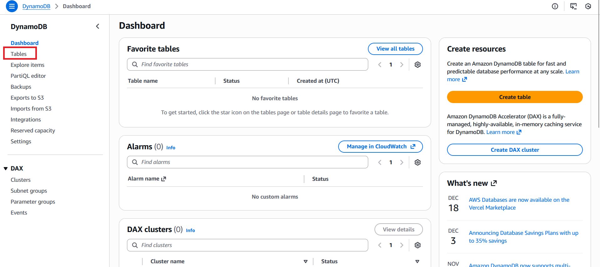
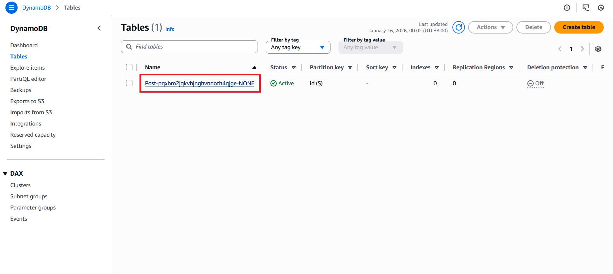
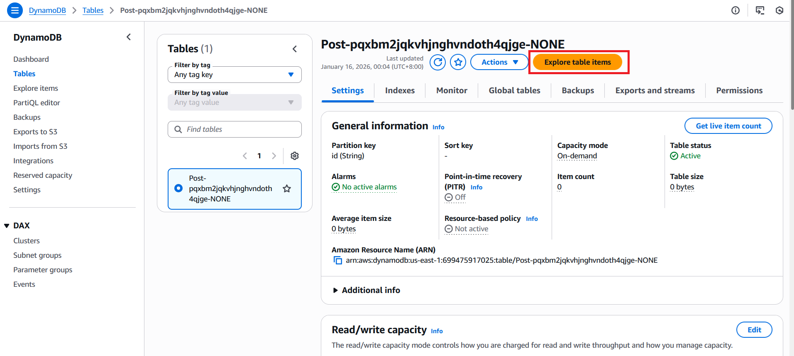
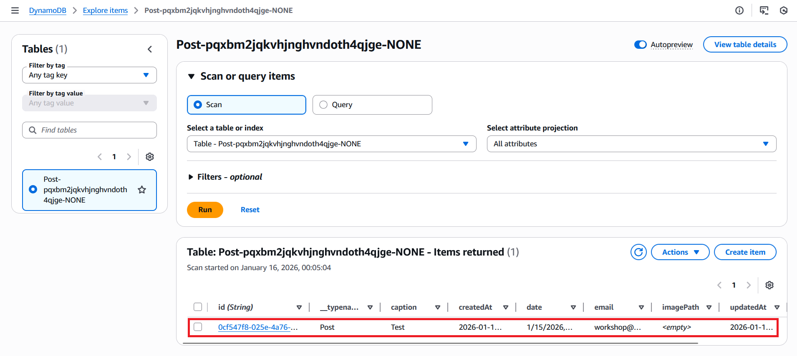

# Creating Posts

Now that we've configured our data backend, we can now implement [CRUD operations](../workshop-elements.md#data-management). For this section, we will be implementing the **Create** operation for our app.

Navigate to `components/Posts.tsx` and do the following:

**Step 1:** Import Schema and Generate Client

At the top of your `Posts.tsx` place the code below:

  ```typescript
  // src/components/Posts.tsx
  import type { Schema } from '../amplify/data/resource'
  import { generateClient } from 'aws-amplify/data'

  const client = generateClient<Schema>()
  ```
  
  **What this does:**

  - A TypeScript schema is generated based on your backend configuration
  - `generateClient<Schema>()` creates a Amplify Data client with full type safety
  - The `client` provides methods for all CRUD operations: `create()`, `update()`, `delete()`, `list()`, and `observeQuery()`
  - Type safety ensures you can only access fields that exist in your schema

---

**Step 2**: Import user from `useAuthenticator`

This will be used to assign our `userId` to a `post` later.

  ```typescript
  // src/components/Posts.tsx

  import { useAuthenticator } from '@aws-amplify/ui-react'

  export default function Posts() {
    const { user } = useAuthenticator();
  ...
  ```

---

**Step 3:** Define the Create Function

  ```typescript
  // src/components/Posts.tsx

  const createPost = async () => {
    const caption = window.prompt("Caption");
    if (!caption) return;   // stop if empty

    const newPost = await client.models.Post.create({
      caption,
      email: user.signInDetails?.loginId,
      userId: user.userId,
      date: new Date().toLocaleString(),
      imagePath: "",
    })
    console.log("Create Post Result: ", newPost)
  };
  ```

  **What this does:**

  - Prompts the user for a post caption using `window.prompt()`

  - `client.models.Post` refers to your defined `Post` schema
  - The `.create()` method sends the new post data to your backend via AWS AppSync


  - `user.signInDetails?.loginId` gets the authenticated user's email
  - `user.userId` provides the unique Cognito user identifier for post ownership
  - `new Date().toLocaleString()` creates a human-readable timestamp
  > `imagePath` is set to empty string initially (will be used for image uploads later)

---

**Step 4:** Add the `onClick` function to the existing button to trigger the `createPost` function

  ```typescript
  // src/components/Posts.tsx

  <button onClick={createPost}>Add Post+</button>
  ```

---

**Step 5:** Confirm if working

1. Try creating a post by clicking the `Add Post+` button

2. Check your network tab or console logs

    - **Oops! Error:** you might see something like:

    ```bash
    Error: Authentication error: Not authorized to perform this operation
    ```

    

    This indicates that we do not have authorization to create a post

3. Fix the error

    - Open your `amplify/data/resource.ts`.
    - Update your [schema authorization rules](permission.md) to enable post creation, might as well add permissions for updating and deleting posts:

    ```typescript
    .authorization(allow => [
      allow.authenticated().to(['read']),
      allow.ownerDefinedIn("userId")
      .identityClaim('sub')
      .to(['create', 'update', 'delete']),
    ])
    ```

    This tells Amplify that we're allowing the user to `create` posts and only `update` and `delete` posts that he/she owns.

    Now that we updated our auth permissions, update your backend by running:

    ```bash
    npx ampx sandbox
    ```

    > Disregard this if you're running the sandbox already as it automatically detects changes to your backend configuration files in `amplify/`

4. Try creating a post again

    Now the request should succeed:

    

    Now, only the post owner can create, update, or delete their own posts, while all authenticated users can read posts.

    
Congrats, you can now create posts successfully! You can view it in the AWS Console.

---

## Preview Data in AWS Console

View Created Posts in DynamoDB

1. **Open AWS Console**: Navigate to [AWS Console](https://console.aws.amazon.com)

2. **Access DynamoDB**: 

     - Search for "DynamoDB" in the services search bar
     - Click on "DynamoDB" to open the service

3. **Find Your Table**:

     - Click "Tables" in the left sidebar
     

     - Look for a table with a name with this format `Post-[random-string]-[environment]`
     
     - This is your automatically generated Post table

4. **View Table Items**:

     - Click on your Post table name
     - Select the "Explore table items" button
     
     - You should see your created post with all the fields you defined
     

     - Each post will show: `id`, `caption`, `email`, `userId`, `date`, `imagePath`
     - The `id` field is automatically generated by Amplify
     - Timestamps show when the post was created and last updated
     - `userId` field shows the Cognito Identity ID of the post owner
