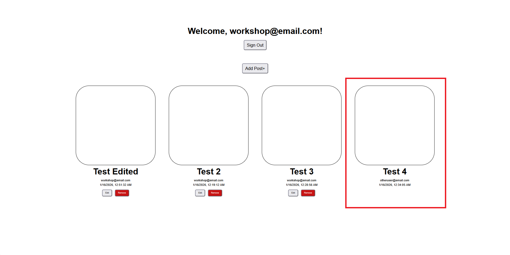

# Updating Posts

Now we'll implement the **Update** operation to allow users to edit their existing posts.

Navigate to `components/Posts.tsx` and follow the steps below:

**Step 1:** Define the Update Function

  ```typescript
  // src/components/Posts.tsx

  const editPost = async (id: string) => {
    const caption = window.prompt("Caption")
    if (!caption) return;   // stop if empty

    const editedPost = await client.models.Post.update({
      id,
      caption: caption,
      date: new Date().toLocaleString(),
    })
  }
  ```
What this does:

  - `editPost` takes the post `id` as a parameter to identify which post to update
  - Prompts the user for a new caption
  - The `.update()` method sends the updated data to your backend
  - Updates the `date` to reflect when the edit was made

  > Notice there are no `userId` and `imagePath` fields. You don’t need to pass fields you don’t want to change; Amplify preserves existing values.

---

**Step 2:** Attach the `editPost` function to the Edit button

Replace this:

  ```typescript
  // src/components/Posts.tsx

  <div className="post-buttons">
    <button>Edit</button>
    <button>Remove</button>
  </div>
  ```
With this:

  ```typescript
  // src/components/Posts.tsx

  <div className="post-buttons">
    <button onClick={() => editPost(id)}>Edit</button>
    <button>Remove</button>
  </div>
  ```

Now it should work!


**Step 3:** Add Authorization Check

We do not want other users to see and an edit button on posts that they do not own. Let's create an authorization function to see if the logged user owns the post.

  ```typescript
  // src/components/Posts.tsx

  const isAuthor = (author: string) => {
    if (user.userId == author) {
      return true
    } else {
      return false
    }
  }
  ```

**Step 4:** Pass `userId` in your `map` function

Inside your return function, update `posts.map()` function to include `userId`

  ```typescript
  // src/components/Posts.tsx
  ...
    {posts.map(({ id, caption, email, date, userId }) => (
  ...
  ```

**Step 5:** Conditionally render Edit and Remove buttons using the `isAuthor` check

Replace this:

  ```typescript
  // src/components/Posts.tsx

  <div className="post-buttons">
    <button onClick={() => editPost(id)}>Edit</button>
    <button>Remove</button>
  </div>
  ```
With this:

  ```typescript
  // src/components/Posts.tsx

  {isAuthor(userId!) &&
    <div className="post-buttons">
      <button onClick={() => editPost(id)}>Edit</button>
      <button>Remove</button>
    </div>
  }
  ```

Great, now it only shows the Edit button if the current user is also the post's author



---

Congrats, you now have post editing functionality!
