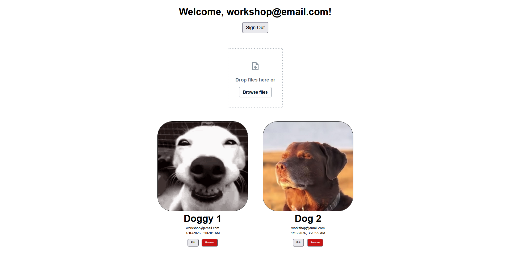

# Displaying Uploaded Images

Now that we have successfully uploaded images to our storage bucket, let's fetch and display them in our application. This is where you'll see your S3 storage integration come to life.

The `StorageImage` component is Amplify's [React](../workshop-elements.md#react) component specifically designed for displaying images stored in [S3](../workshop-elements.md#amazon-s3). It automatically handles authentication, URL generation, and loading states, so you don't need to manually manage these complex processes.

## Understanding Image Storage Flow

When a user uploads an image, here's what happens:

1. Image gets stored in S3 with a unique path
2. The image path gets saved to your DynamoDB table as part of the post data
3. When displaying posts, we use this path to fetch and show the image
4. `StorageImage` handles all the authentication and URL generation automatically

## Setting Up `StorageImage`

First, import the `StorageImage` component along with your existing imports:

```typescript
// src/components/Posts.tsx

import { FileUploader, StorageImage } from '@aws-amplify/ui-react-storage';
```

Update your posts mapping to include `imagePath` in the destructuring. This field contains the S3 path to each post's image:

```typescript
// src/components/Posts.tsx

{posts.map(({ id, caption, email, userId, date, imagePath }) => (
  <div className="post" key={id}>
    {/* Image will be added here */}
    <h1 className="caption">{caption}</h1>
    <p className="user">{email}</p>
    <p className="date">{date}</p>
  </div>
))}
```

Integrate the `StorageImage` component to render the uploaded images. Note that we’ve included a conditional check to ensure images only attempt to load when an `imagePath` is present:

```typescript
// src/components/Posts.tsx

{posts.map(({ id, caption, email, userId, date, imagePath }) => (
  <div className="post" key={id}>
    {imagePath && (
      <StorageImage alt={caption} path={imagePath} />
    )}
    <h1 className="caption">{caption}</h1>
    <p className="user">{email}</p>
    <p className="date">{date}</p>
  </div>
))}
```

### How It Works

**Accessibility:** `alt={caption}` uses the post caption as alternative text for screen readers, making your app more accessible.

**Automatic authentication:** `StorageImage` automatically includes the user's authentication tokens when fetching images from S3.

**Path resolution:** The `path={imagePath}` prop tells the component exactly which file to fetch from your S3 bucket.

### Test If It Works

Save your changes and refresh your application. You should now see:

1. **Uploaded images displaying automatically** in each post
2. **Proper loading behavior** as images fetch from S3
3. **No broken images** for posts without uploaded files
4. **Responsive image sizing** that fits your post layout

If you uploaded images in previous steps, they should now be visible in your posts. If not, try uploading a new image to see the complete flow in action.



## Troubleshooting `StorageImage`

**Images not showing?**

Check that:

- Your storage resource is properly deployed
- The `imagePath` field contains valid S3 paths
- Your user has read permissions for the images
- Your browser console for any authentication errors

**Images loading slowly?**

This is normal for the first load as images are fetched from S3. Subsequent loads will be much faster due to browser caching.

For additional S3 implementation features, you can refer to [Amplify's Storage documentation](https://docs.amplify.aws/react/build-a-backend/storage/) for more advanced use cases.

Your posts now display both text and images, creating a much more engaging user experience!
