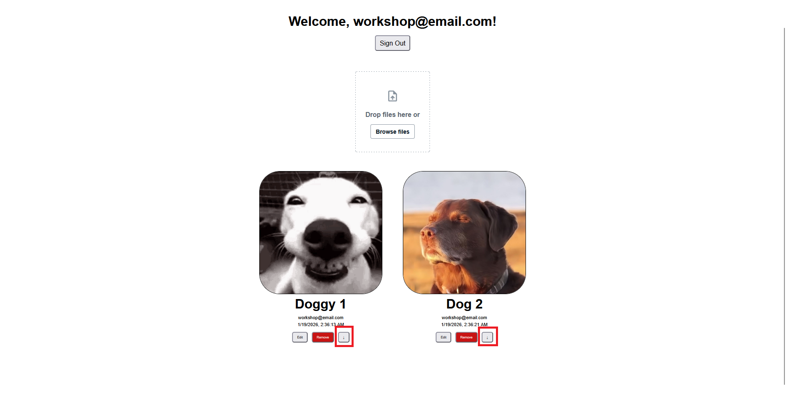

# Downloading Files from Storage

Now that users can upload, view, and delete images, let's add the ability to download them. This gives users control over their files and demonstrates how to retrieve data from [S3](../workshop-elements.md#amazon-s3) storage programmatically.

The `downloadData` function is Amplify's method for retrieving files from S3 storage. Unlike `StorageImage` which displays files, it lets you access the actual file content for downloading, processing, or other operations. It respects the same access rules you defined earlier, so users can only download files they have permission to access.

## Setting Up File Download

First, import the `downloadData` function from Amplify Storage:

```typescript
// src/components/Posts.tsx

import { downloadData } from 'aws-amplify/storage';
```

Then create the download function that will handle button click. Add this code to your Posts component:

```typescript
// src/components/Posts.tsx

const downloadPost = async (imagePath: string) => {
  const { body } = await downloadData({ path: imagePath }).result;
  const blob = await body.blob();

  const url = URL.createObjectURL(blob);

  const link = document.createElement("a");
  link.href = url;
  link.download = imagePath.split("/").pop() ?? "download";
  link.click();

  URL.revokeObjectURL(url);
};
```

How it works:

**Fetches the file:** `downloadData({ path: imagePath }).result` retrieves the file from S3 using the stored path from your database.

**Converts it to blob:** `body.blob()` converts the response stream into a blob object that browsers can handle for downloads.

**Creates download URL:** `URL.createObjectURL(blob)` generates a temporary URL that points to the file content in memory.

**Triggers download:** We create an invisible `<a>` element, set its href to our blob URL, and programmatically click it to start the download.

**Extracts filename:** `imagePath.split("/").pop()` gets the original filename from the S3 path

**Cleanup:** `URL.revokeObjectURL(url)` releases the memory used by the temporary URL to prevent memory leaks.

---

Now let's modify our JSX to render a download button

Add it alongside your existing edit and delete buttons, but make it outside the `isAuthor` condition to allow everyone to download:

```typescript

// src/components/Posts.tsx
  ...  
  <div className="post-buttons">

    {/* Edit and delete only for post owners */}
    {isAuthor(userId!) && (
      <>
        <button onClick={() => editPost(id)}>Edit</button>
        <button onClick={() => imagePath && deletePost(id)}>Remove</button>
      </>
    )}

    {/* Download button available to everyone */}
    <button onClick={() => imagePath && downloadPost(imagePath)}>↓</button>
  </div>
  ...
```
> Same with our Remove button, we add a guard condition to ensure that the `imagePath` exists before running the function

Now you can successfuly download images from any of the posts!



## Error Handling

For best practices, consider adding error handling to provide better user feedback:

```typescript
// src/components/Posts.tsx

const downloadPost = async (imagePath: string) => {
  try {
    const { body } = await downloadData({ path: imagePath }).result;
    const blob = await body.blob();
    
    const url = URL.createObjectURL(blob);
    const link = document.createElement("a");
    link.href = url;
    link.download = imagePath.split("/").pop() ?? "download";
    link.click();
    URL.revokeObjectURL(url);
  } catch (error) {
    console.error('Download failed:', error);
    alert('Failed to download file. Please try again.');
  }
};
```

## Testing File Downloads

Save your changes and test the download functionality:

1. **Upload an image** to create a post with a file
2. **Locate the download button** (↓) on your own posts
3. **Click the download button** and check your downloads folder
4. **Verify the filename** matches the original uploaded file

The download should start immediately and save the file to your browser's default download location.


Your users now have complete control over their uploaded files: they can upload, view, and download images while maintaining security!
