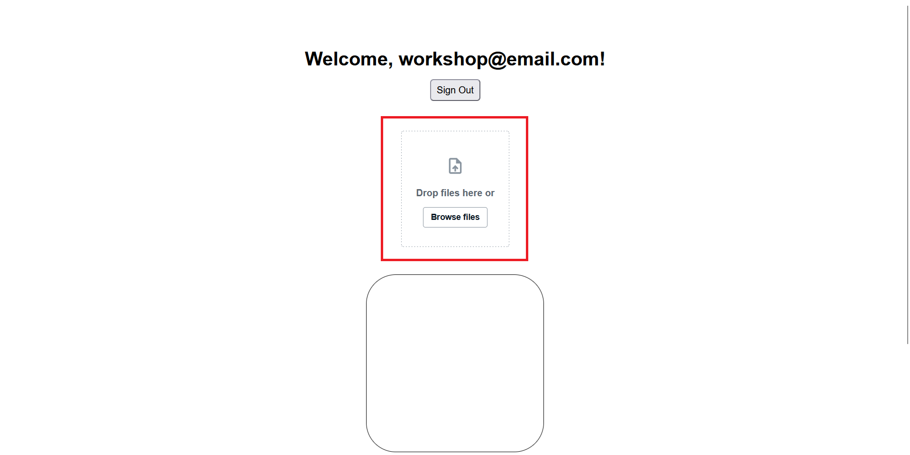
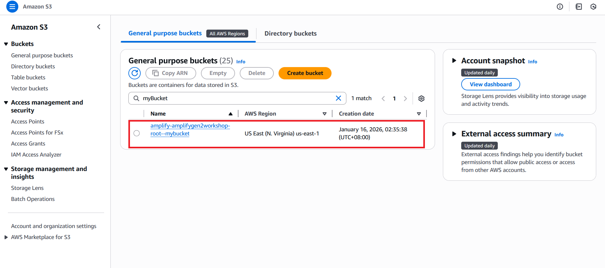
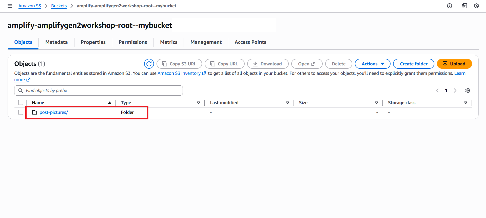
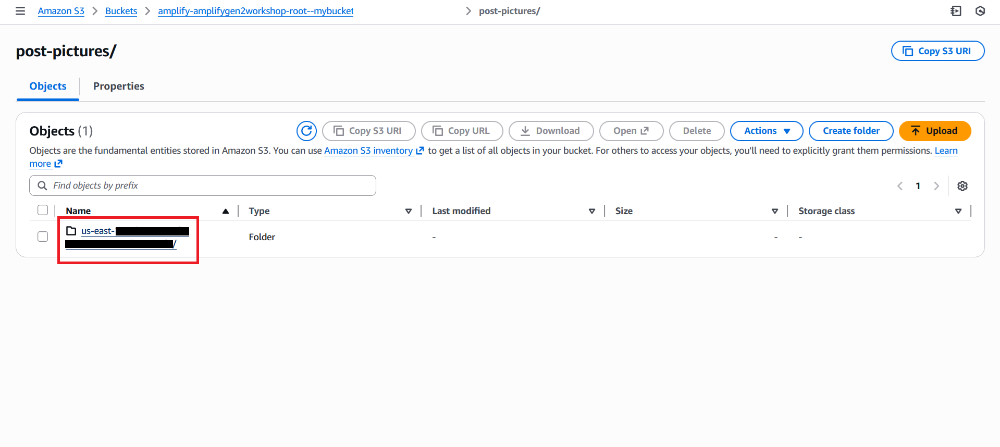
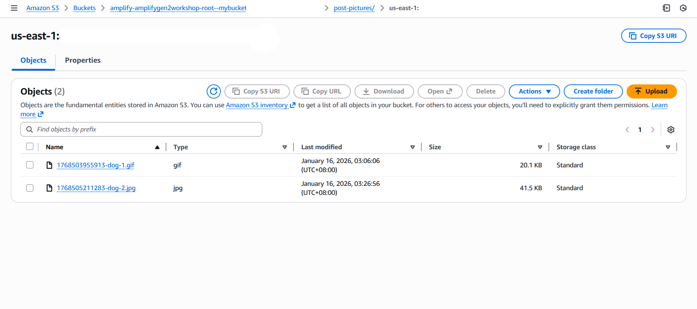
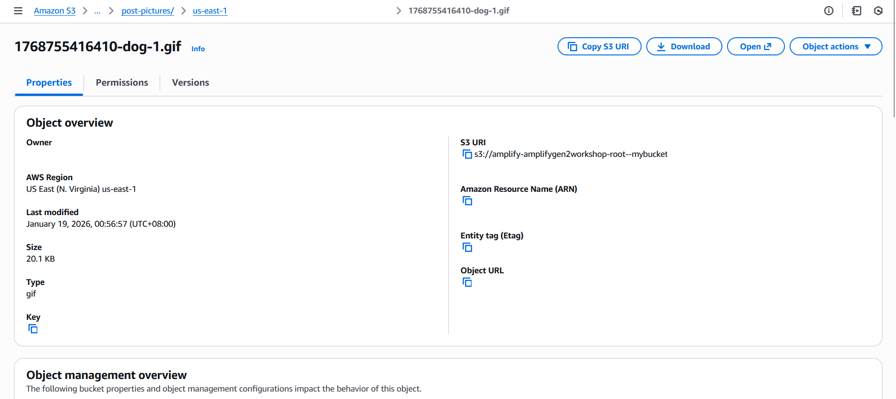

# Setup File Upload

Now that we have our Storage Bucket. Lets implement file upload functionality for our Post images.

There are two ways to implement file upload in Amplify Gen 2:

- using the `uploadData` hook 
- using the `FileUploader` UI component

---

## Using `uploadData`

Add these imports at the top of `Posts.tsx`:

```typescript
// src/components/Posts.tsx

import { uploadData } from 'aws-amplify/storage'
import { fetchAuthSession } from 'aws-amplify/auth';
```

What this does:

- `uploadData` handles file uploads to S3 storage
- `fetchAuthSession` gets the user's identity

Modify `createPost` by replacing it with the code below:

```typescript
// src/components/Posts.tsx

const createPost = async () => {
  const session = await fetchAuthSession();
  const identityId = session.identityId;

  const fileInput = document.createElement('input');
  fileInput.type = 'file';
  fileInput.accept = 'image/*';

  fileInput.onchange = async (e) => {
    const file = (e.target as HTMLInputElement).files?.[0];
    if (!file) return

    const path = `post-pictures/${identityId}/${Date.now()}-${file.name}`;
    uploadData({ path, data: file });

    const caption = window.prompt("Caption");
    if (!caption) return;

    const newPost = await client.models.Post.create({
      caption,
      email: user.signInDetails?.loginId,
      userId: user.userId,
      date: new Date().toLocaleString(),
      imagePath: path,
    })

    console.log("Create Post Result: ", newPost)
  };

  fileInput.click();  // Automatically opens up file input modal
}
```

Let's break down the code above and explain each section:

**Get User Identity**

```typescript
const session = await fetchAuthSession();
const identityId = session.identityId;
```

- Gets the authenticated user's unique Cognito Identity ID
- Used to create user-specific file paths for security

**File Selection**

```typescript
const fileInput = document.createElement('input');
fileInput.type = 'file';
fileInput.accept = 'image/*';
```

- Creates a hidden file input element
- Restricts selection to image files only

**Upload & Save**
```typescript
path = `post-pictures/${identityId}/${Date.now()}-${file.name}`;
uploadData({ path, data: file });
```

- Creates unique file path with timestamp to prevent conflicts
- Organizes files by user identity for security
- Uploads file to S3, specifically in the specified storage bucket `path`

**Store Path**
```typescript
imagePath: path,

```

- Saves the file path in DynamoDB for later retrieval
- Path will be used to display our images later

## Using `FileUploader`

The `uploadData` is great to use especially if you want full control. But if you want an easier way to just quickly upload your files, you can use Amplify's `FileUploader` UI component.

So undo everything from the top

Install the library below

```bash
npm install @aws-amplify/ui-react-storage aws-amplify
```

Import it on the top of your `Posts.tsx`

```typescript
// src/components/Posts.tsx

import { FileUploader } from '@aws-amplify/ui-react-storage';

```

Revert your `createPost` to the original function then add a function parameter `path`:

```typescript
// src/components/Posts.tsx

const createPost = async (path: string) => {
  const caption = window.prompt("Caption");
  if (!caption) return;

  const newPost = await client.models.Post.create({
    caption,
    email: user.signInDetails?.loginId,
    userId: user.userId,
    date: new Date().toLocaleString(),
    imagePath: path,
  })

  console.log("Create Post Result: ", newPost)
}
```
In your return function, replace the "Add Post+" button with the `<FileUploader/>` component

```typescript
// src/components/Posts.tsx

<FileUploader
  path={({ identityId }) => `post-pictures/${identityId}/${Date.now()}-`}
  maxFileCount={1}
/>
```

Now you can see a File Uploader UI in your application



Since we don't have a button to call `createPost` anymore, add it to the component's `onUploadSuccess` attribute instead

```typescript
// src/components/Posts.tsx

<FileUploader
  ...
  onUploadSuccess={({ key }) => key && createPost(key)}
/>
```

> We add a guard condition `key &&` to ensure that the `key` exists before running the function

The `key` refers to the `file.key` which holds the S3 path of the uploaded file. Effectively saving the path to our `Post`

You could also add **file upload limits** such as `acceptedFileTypes` and `maxFileSize`

```typescript
// src/components/Posts.tsx

<FileUploader
  ... 
  acceptedFileTypes={['.jpg', '.gif', '.png']}
  maxFileSize={5000000} // In bytes
/>
```

The above attributes limit our file uploads to `.jpg`, `.gif`, and `.png`. It also throws an error when uploading a file larger than the `maxFileSize` 

Now we can upload files similarly to using `uploadData` with less manual scripting


## Preview Uploaded Files in S3 Console

**Step 1:** Access S3 Console

  - Navigate to [AWS Console](https://console.aws.amazon.com)
  - Type "S3" in the services search bar
  - Click on "S3" to access the storage service

**Step 2:** Find Your Storage Bucket

  - Look for a bucket with name like `amplify-[app-name]-[environment]-[random-string]-bucket`
  - Click to open your Amplify storage bucket

  

**Step 3:** Navigate to Uploaded Files

  - Navigate to `post-pictures/` folder inside your bucket

  

  - Look for a folder named with your Cognito Identity ID

  

**Step 4:** View Your Uploaded Images

  - You'll see your uploaded images with names like:
     - `1234567890-image.jpg`
     - `1234567891-photo.png`

     

  - Preview Images: 
     - Click on any image file name
     - You can see file details like size, upload date, and storage class

     

     - Select "Open" or "Download" to view the image

     
