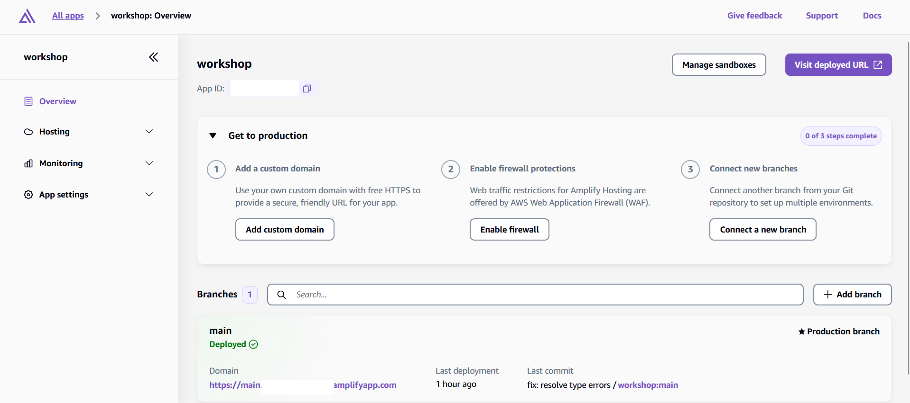
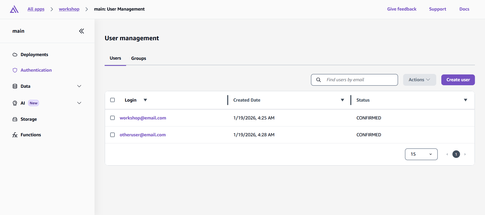
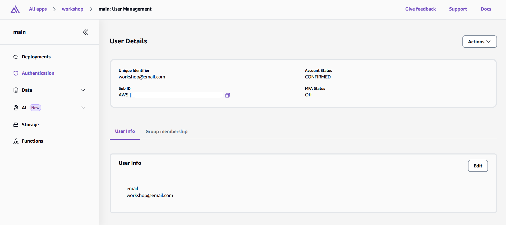
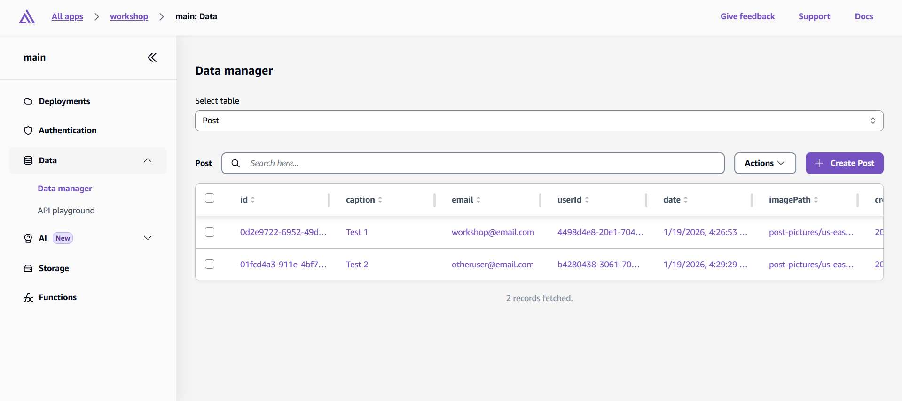
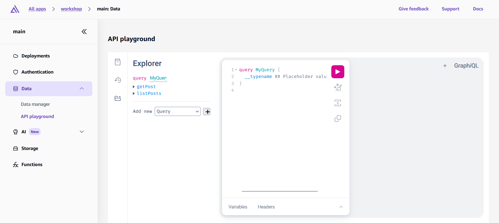
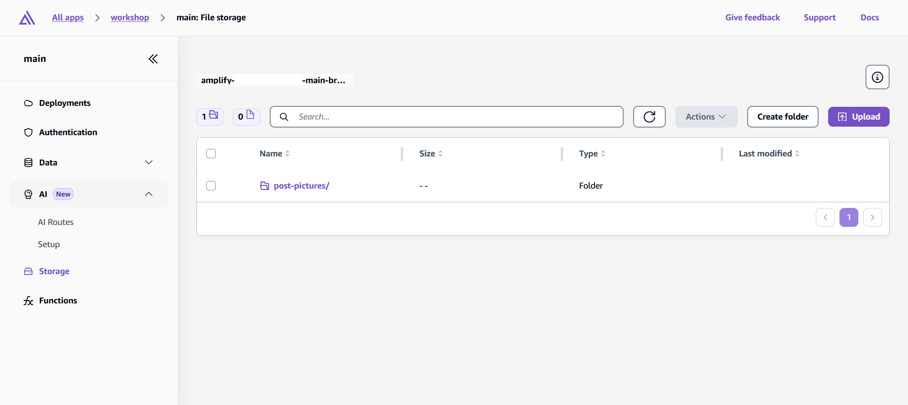

# Managing Your App in the Amplify Console

Now that you've built your complete application, let's explore how to manage and monitor it through the AWS Amplify Console. This is your central dashboard for overseeing all aspects of your deployed application.

## Console Features and Deployment Management

The Amplify Console provides comprehensive management for your application:

**General Management Features:**

- **Branch Management** - View deployment status, configure environments, set up custom domains
- **Build Configuration** - Review build logs, configure environment variables, set up webhooks
- **Monitoring** - Track performance metrics and set up CloudWatch alerts
- **Cost Monitoring** - View usage breakdown and set up billing alerts

**Branch Specific Features:**

- **Authentication** - Manage user accounts, passwords, and access control
- **Data** - Monitor GraphQL API and DynamoDB tables  
- **Storage** - View and manage S3 bucket files and folders

## Exploring Your Application Features

Click on your **main branch** in the Amplify Console to access the detailed management features for Authentication, Data, and Storage. These are accessible at the left sidebar.

### Authentication Management

Your authentication system is powered by Amazon Cognito, but Amplify allows you to manage your users here as well.

**User Account Management:**

- View usernames, email addresses, and registration status
- Enable or disable user accounts
- Reset user passwords manually
- Force email verification for unverified accounts
- Assign users to groups for role-based access control

### Data Management

Your GraphQL API and DynamoDB tables are also accessible through the console for monitoring and management.

- Access your DynamoDB tables directly
- View table items and data structure

- Use the GraphQL API playground for testing

### Storage Management

Amplify console also allows you to monitor your S3 bucket.

- View uploaded files and storage usage
- Create folders and organize files
- Upload, move, rename, and delete files
- Monitor storage costs and usage patterns

The Amplify Console provides a comprehensive management interface for your entire application stack, allowing you to monitor performance, manage users, configure deployments, and optimize costs all from this single dashboard.
