# Deploying Your Application to Production

You've built a complete full-stack application with authentication, a database, file storage, and a React frontend. Now let's deploy it to production so anyone can access it on the internet.

**What is Production Deployment?**

So far, you've been working in a "sandbox" environment (a safe space for development and testing). Production deployment means making your app available to real users on the internet with a public URL. AWS Amplify makes this process straightforward by connecting to your GitHub repository and automatically building and deploying your app whenever you push code changes.

## Preparing for Production

Before deploying, let's make sure your code is ready and pushed to GitHub.

**1. Commit your changes to Git**

First, add all your files to Git:

```bash
git add .
git commit -m "feat: complete workshop"
```

**2. Push to GitHub**

```bash
git push origin main
```

**3. Verify your repository**

Go to your GitHub repository in your browser and confirm all your code is there, including:

- Your React app in the `src/` folder
- Your Amplify backend in the `amplify/` folder

## Setting Up Amplify Hosting

**What is Amplify Hosting?**

Amplify Hosting is AWS's service for deploying web applications. It automatically builds your React app, deploys it to a global content delivery network (CDN), and gives you a public URL. It also sets up continuous deployment - whenever you push changes to GitHub, Amplify automatically rebuilds and redeploys your app.

## Steps to Deploy

1. **Go to the AWS Amplify Console**  

      Open the [Amplify Console](https://console.aws.amazon.com/amplify/).

2. **Click "Create App" or "Deploy an App"**  

      You'll find this option on the homepage of the Amplify dashboard.
      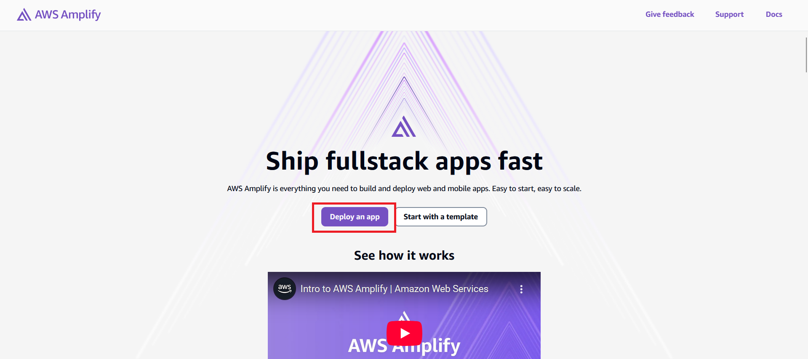

3. **Select GitHub as your Git provider**  

      Amplify supports GitHub, GitLab, Bitbucket, and CodeCommit.
      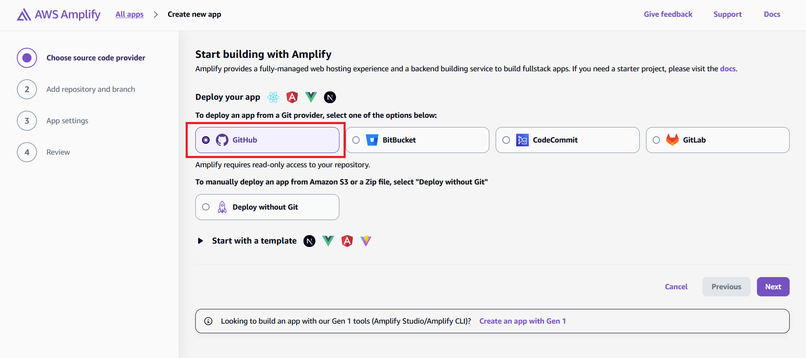

4. **Click Next and Authorize Amplify to access your GitHub account**  

      This is a one-time GitHub App authorization.
      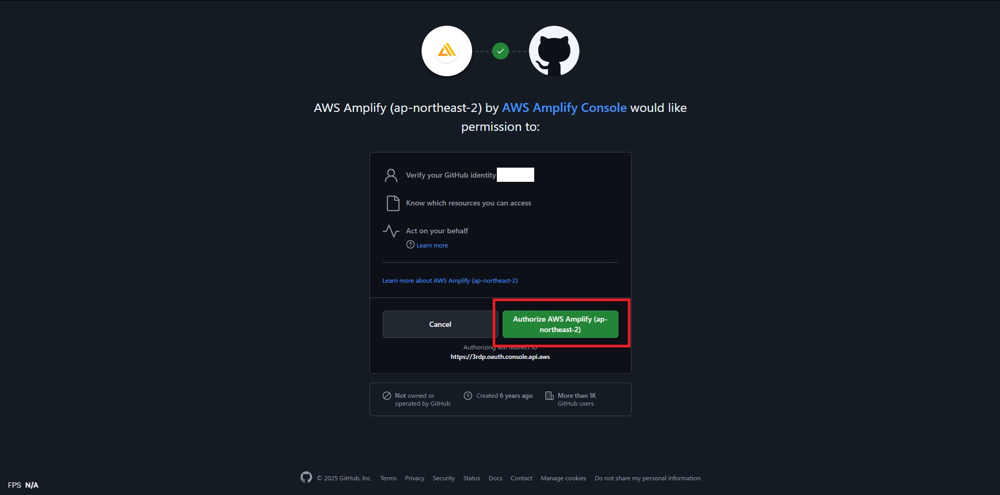

5. **Update Github permission if your repository is not found**

      Choose the repository to give Amplify access.
      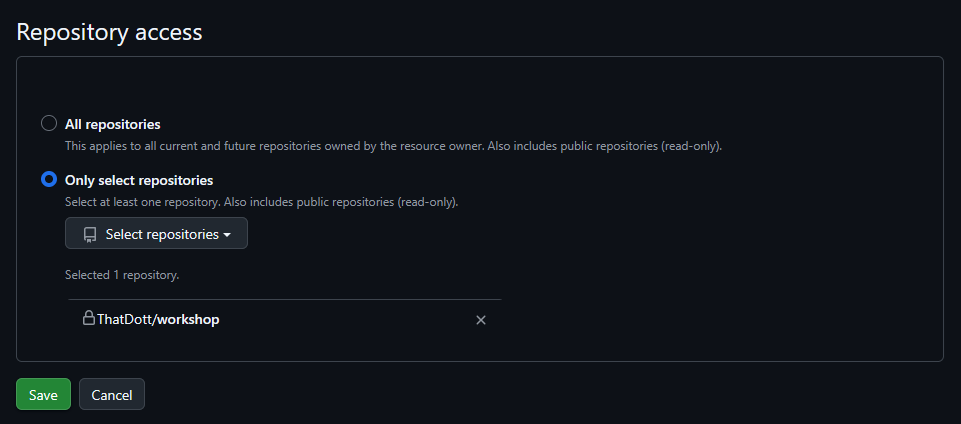

5. **Select your repository**  

      Back to Amplify console, select the repo containing your React app from the list.
      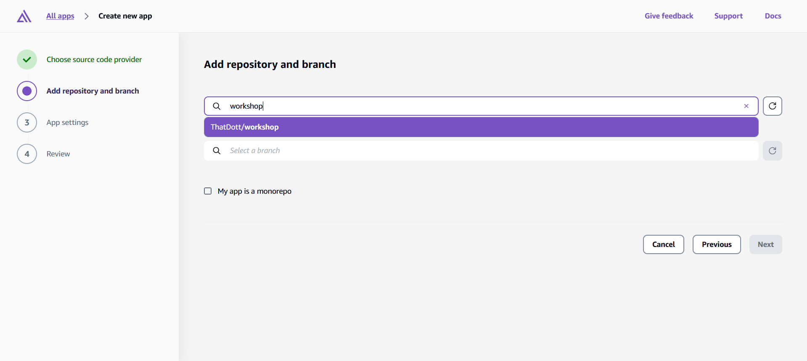

6. **Choose the branch to deploy**  

      Usually `main`, depending on your project.
      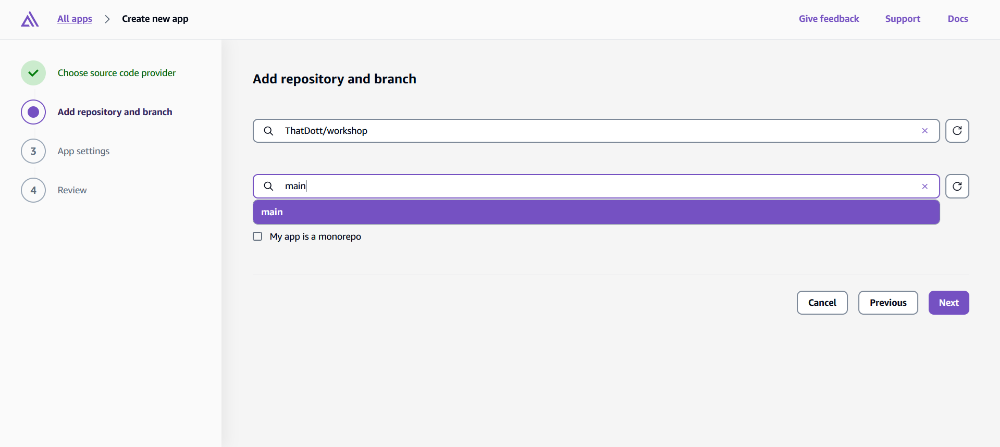

7. **(Optional) Configure app settings**  
   
      You can customize build settings, but Amplify automatically adjusts this according to your app, so you may just click **Next** to continue.
      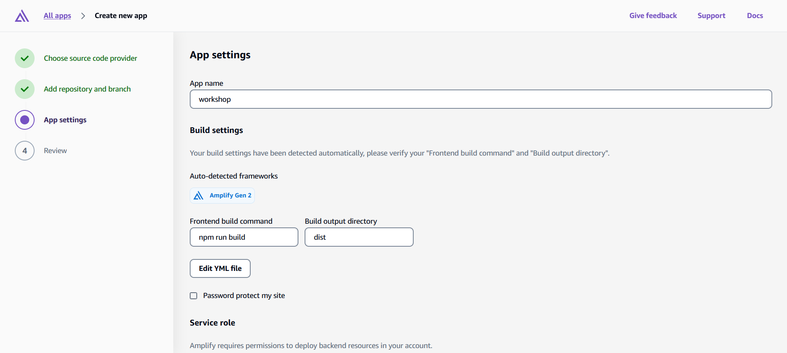

8. **Review settings and click "Save and Deploy"**  
   
      You may review your settings and start deploying.
      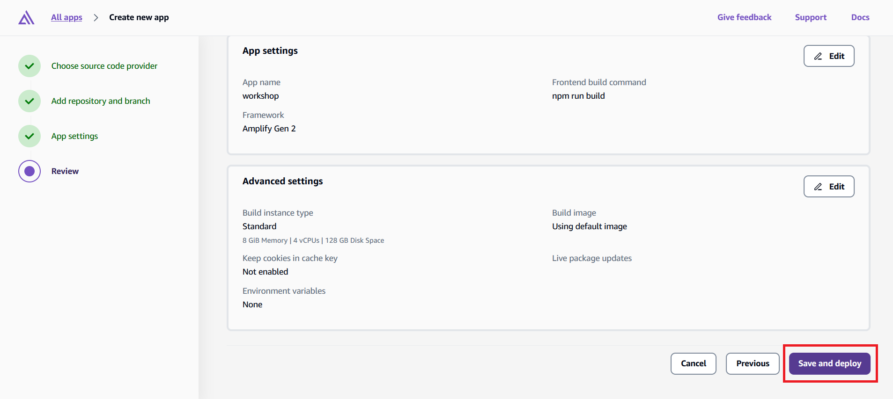

9. **Wait for the build to complete**  
   
      After a few minutes, your app will be live on an Amplify-hosted URL.
      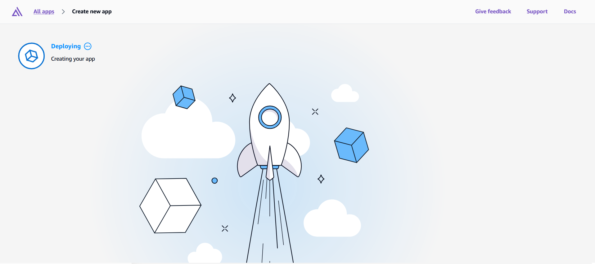

10. **View your Deployed App**

      Click on "Visit Deployed URL" to visit your deployed app.
      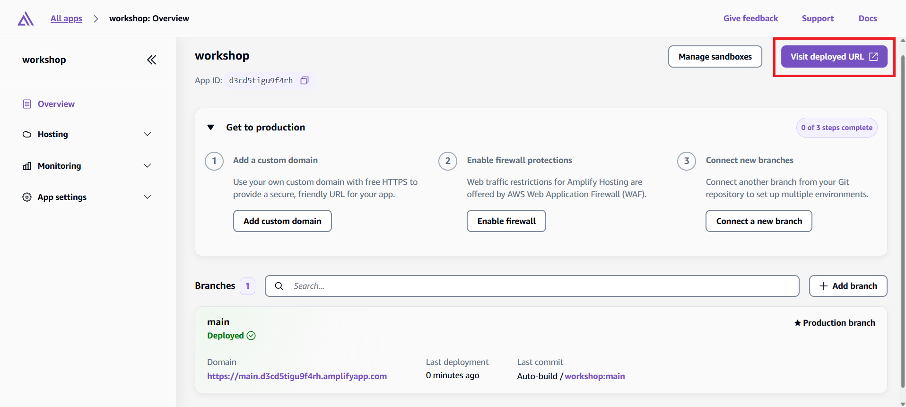

      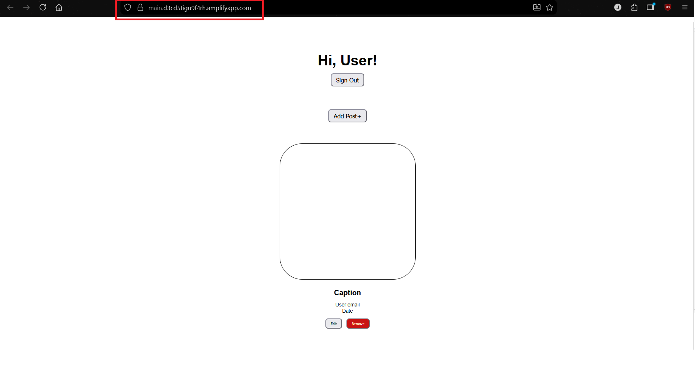
      Congrats, you've successfully deployed your app on Amplify!

## Understanding the Deployment Process

Watch the deployment progress in the Amplify Console. Here's what happens during deployment:

**Provision** - Amplify sets up the hosting infrastructure

**Build** - Downloads your code from GitHub and runs `npm run build`

**Deploy** - Uploads your built application to the CDN

**Verify** - Runs tests to ensure everything deployed correctly

The entire process usually takes 3-5 minutes. You'll see real-time logs showing the build progress.

## Connecting Backend to Frontend

Amplify generates a new `amplify_outputs.json` for our production environment. It automatically connects your frontend to your production backend. This means you have a separate stack of resources for your production deployment where you can view in AWS CloudFormation.

## Testing Your Live Application

Once deployment completes, Amplify provides you with a public URL like `https://main.d1234567890.amplifyapp.com`. 

Open that URL and test your application:

1. **Registration and login** - Create a new account (use a real email address)
2. **Create posts** - Add some blog posts with images
3. **Real-time updates** - Open the app in multiple browser tabs and see changes sync instantly
4. **File uploads** - Upload images and verify they display correctly

Your application is now live and ready for real users!
