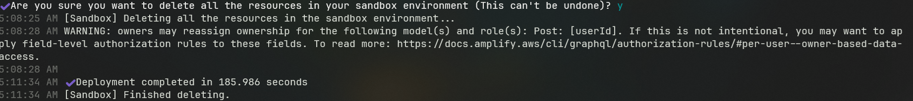
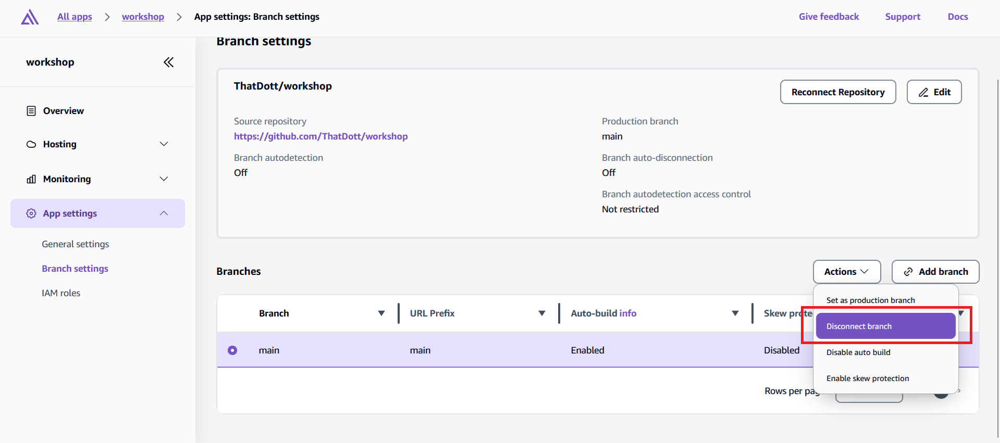
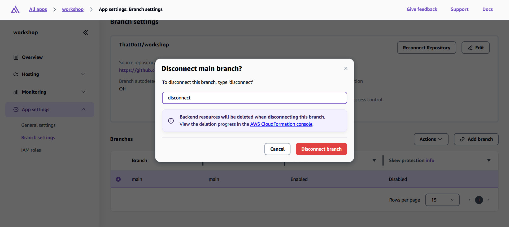
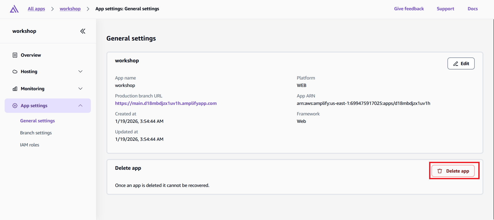
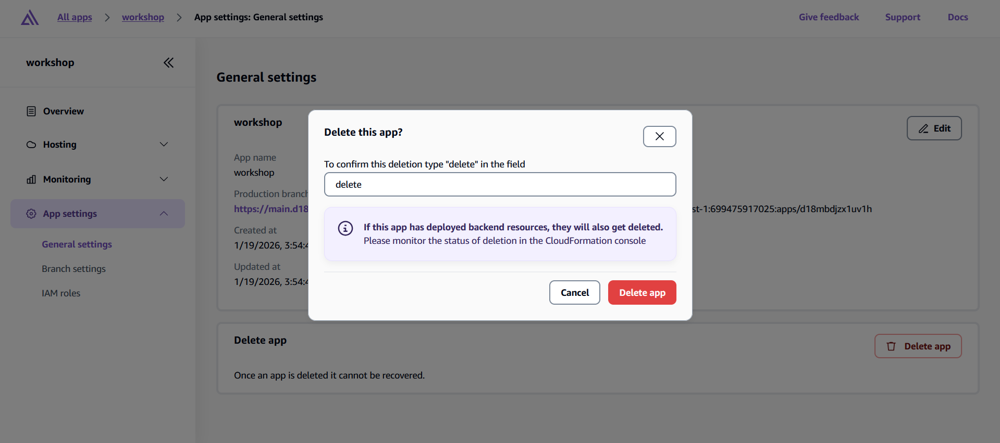

# Cleaning Up Your AWS Resources

After completing the workshop, you'll want to clean up the AWS resources to avoid any hidden ongoing charges.

## Why clean up?

While many AWS services have free tiers, some resources (like DynamoDB storage and S3 file storage) can accumulate small charges over time. Cleaning up ensures you won't have any unexpected costs and keeps your AWS account organized.

## Understanding Your Resource Types

During this workshop, you created two types of environments:

**Sandbox Environment** - Your development environment created with `npx ampx sandbox`
**Production Environment** - Your live application deployed through the Amplify Console

Each needs to be cleaned up differently.

## Cleaning Up Your Sandbox Environment

Your sandbox environment is the easiest to clean up because it's designed for temporary development work.

**What is a CloudFormation Stack?**

When you ran `npx ampx sandbox`, Amplify used AWS CloudFormation to create all your resources. CloudFormation is AWS's infrastructure-as-code service that groups related resources into "stacks." Your entire backend (Cognito, AppSync, DynamoDB, S3) exists as one stack that can be deleted all at once.

**Delete your sandbox:**

```bash
npx ampx sandbox delete
```



**What happens during deletion:**

1. **Identity verification** - The CLI confirms which sandbox belongs to you
2. **Stack destruction** - CloudFormation begins removing all resources
3. **Resource teardown** - Each service is deleted:
      - S3 buckets (after emptying them)
      - DynamoDB tables
      - AppSync API
      - Cognito User and Identity Pools
      - IAM roles and policies

The deletion process usually takes 5-10 minutes. You'll see progress updates in your terminal.

## Cleaning Up Your Production Environment

Your production environment requires a different approach since it's managed through the Amplify Console.

**Option 1: Delete specific branches (if you have multiple environments)**

If you only want to remove a staging environment but keep production:

1. Go to the [AWS Amplify Console](https://console.aws.amazon.com/amplify/)
2. Select your application
3. Navigate to the "App Settings" tab
4. Find the branch you want to delete
5. Click the "Actions" dropdown and select "Disconnect branch"

    

6. Confirm disconnection

    

**Option 2: Delete the entire application**

To remove everything (recommended for this workshop):

1. In the Amplify Console, go to your app
2. Click "App settings" in the left sidebar
3. Select "General settings"
4. Scroll down and click "Delete app"

    

5. Type "delete" in the confirmation box and click "Delete app"

    

**What gets deleted:**

- Your hosted frontend application and URL
- All backend resources (same as sandbox: Cognito, AppSync, DynamoDB, S3)
- CI/CD pipeline and build history
- Custom domain configurations (if you set any up)

## Verifying Complete Cleanup

After deletion, it's good practice to verify everything was removed properly:

**Check CloudFormation:**

1. Go to the [CloudFormation Console](https://console.aws.amazon.com/cloudformation/)
2. Look for any stacks with names starting with "amplify-"
3. If you see any in "DELETE_FAILED" status, you may need to manually delete them

**Check S3 Buckets:**

1. Go to the [S3 Console](https://console.aws.amazon.com/s3/)
2. Look for buckets with names containing "amplify" or your app name
3. If any remain, delete them manually (empty them first if they contain files)

**Check IAM Roles:**

1. Go to the [IAM Console](https://console.aws.amazon.com/iam/)
2. Check the "Roles" section for any Amplify-related roles
3. These should be automatically deleted, but verify they're gone

Most workshop participants stay well within free tier limits, but cleaning up ensures zero ongoing costs. You can always recreate this entire application later by running `npx ampx sandbox` in your project directory.

---

Your AWS account is now clean and ready for your next project!
