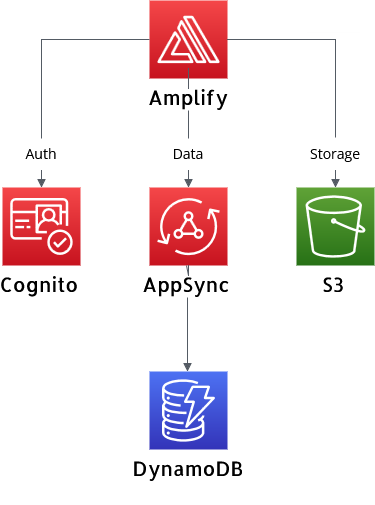

# Workshop Overview

## What is AWS Amplify Gen 2?

AWS Amplify is Amazon's platform for building full-stack web and mobile applications. Think of it as your development toolkit that handles all the backend complexity while you focus on building your app's features. Gen 2 represents the latest evolution of Amplify, moving from configuration files to a code-first approach that gives you more control and flexibility.

In this workshop, you'll build a complete application that demonstrates Amplify's core capabilities. Here's what we'll cover and the AWS services powering each feature:

**Authentication with AWS Cognito**

AWS Cognito is Amazon's user management service. It handles user registration, login, password resets, and multi-factor authentication. Instead of building your own user system (which is complex and security-sensitive), Cognito provides enterprise-grade authentication out of the box.

**GraphQL API with AWS AppSync**

AWS AppSync is a managed GraphQL service. GraphQL is a query language that lets your frontend request exactly the data it needs. AppSync automatically handles the infrastructure, scaling, and real-time subscriptions, so your app can update instantly when data changes.

**Database with Amazon DynamoDB**

Amazon DynamoDB is a NoSQL database that scales automatically. Unlike traditional databases that require server management, DynamoDB handles all the infrastructure while providing consistent performance at any scale.

**File Storage with Amazon S3**

Amazon S3 (Simple Storage Service) is object storage for the internet. It's where you'll store user-uploaded files like images and documents. S3 handles durability, availability, and can serve files directly to users worldwide.

**Technologies we'll use:**

- React + TypeScript for the frontend
- AWS Amplify Gen 2 for backend integration
- The AWS services mentioned above

By the end of this workshop, you'll have a working application deployed to the cloud with user authentication, data persistence, file uploads, and real-time updates.

